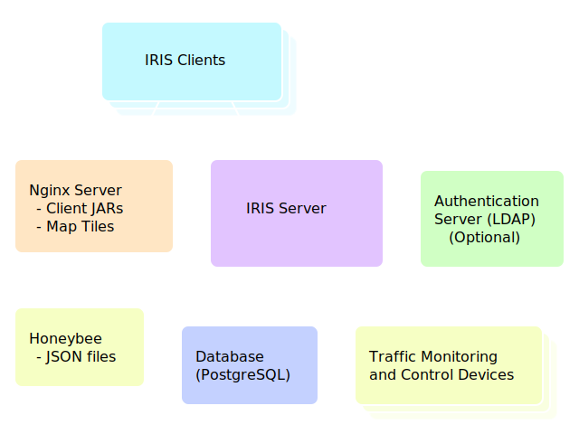

# IRIS

IRIS — the _Intelligent Roadway Information System_ — is an advanced traffic
management system.  It is an integrated platform for transportation agencies to
manage traffic monitoring and control devices.  The software is written in
[Java] and licensed for anyone to use under the [GPL].  In addition, all
dependencies required to install and operate an IRIS system are available as
free software.

The IRIS software presents an intuitive map-based interface to system operators.
This user interface has been refined over many iterations by getting feedback
from operators to streamline their workflow.

## System Architecture

The software has a client/server architecture.  System configuration data is
stored in a [PostgreSQL] database, and managed by the IRIS server.  The server
also handles communication with all traffic control and data collection devices.
The client software is distributed by an [Apache] web server, using Java Web
Start.  All communication between the server and clients is encrypted using
_transport layer security_ (TLS).  The server may be configured to pass
authentication requests off to an external LDAP server, allowing IRIS to
integrate into an existing authentication system.

[Apache]: http://projects.apache.org/projects/http_server.html
[GPL]: http://www.gnu.org/licenses/old-licenses/gpl-2.0.html
[Java]: http://www.java.com
[PostgreSQL]: http://www.postgresql.org
