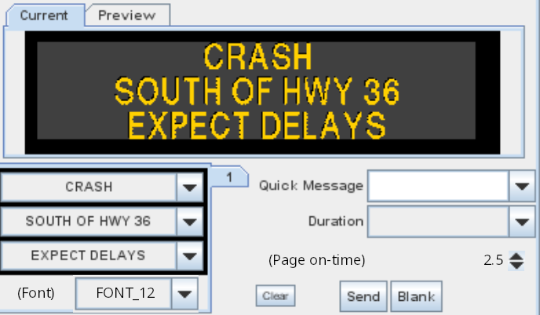
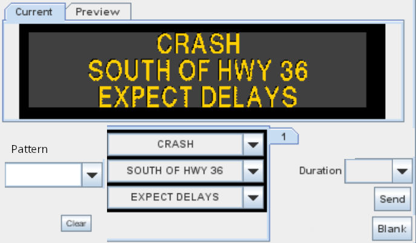

# DMS Message Composer Redesign

## Current Composer UI

The operator selects a message line-by-line of sign text on the left.
Alternatively, a **Quick Message** can be selected.  There are _optional_
Font and Page on-time widgets.  In addition, there are other fields which
determine how a message is composed: **exclude_font**, **override_font**,
**overrode_foreground** and **override_background**.

## Redesigned Composer UI

Now, the operator selects a message **Pattern** first, or accepts the default.
Then, depending on the pattern, may optionally select sign text line-by-line.
The pattern determines which font, foreground and background colors, page times,
graphics, color rectangles, justifaction, character spacing, etc.  If a pattern
contains no text, or ends with a text rectangle, then sign text can be placed
there using the line-by-line method.  Otherwise, it acts like a quick message.

## Changes

* Remove `sign_configuration.exclude_font`
* Remove `dms.override_font`
* Remove `dms.override_foreground`
* Remove `dms.override_background`
* Remove `dms_font_selection_enable` system attribute
* Remove `dms_page_on_selection_enable` system attribute
* Rename `quick_message` to `msg_pattern`
