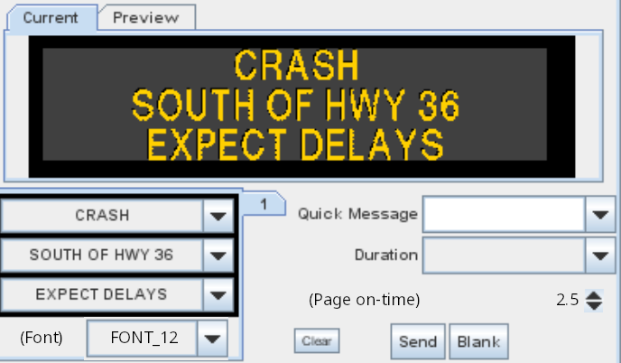
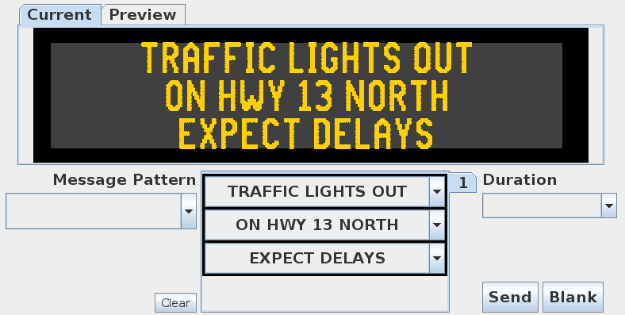

# DMS Message Composer Redesign

## Old Composer UI (before v5.37)

The operator would select a message line-by-line of sign text on the left.
Alternatively, a **Quick Message** could be selected.  There were _optional_
Font and Page on-time widgets.  In addition, there were other fields which
determine how a message was composed: **exclude_font**, **override_font**,
**overrode_foreground** and **override_background**.

## New Composer UI (v5.37+)

With v5.37+, the operator selects a **Message Pattern** first, or accepts the
default. Then, depending on the pattern, may optionally select sign text
line-by-line.  The pattern determines which font, foreground and background
colors, page times, graphics, color rectangles, justifaction, character
spacing, etc.  If a pattern contains [fillable text rectangles], then sign text
can be placed there using the line-by-line method.  Otherwise, it acts like a
quick message.

The following features were **removed**, since message patterns make them
redundant:

* `dms_font_selection_enable` system attribute
* `dms_page_on_selection_enable` system attribute
* DMS `override_font`
* DMS `override_foreground`
* DMS `override_background`
* Sign Config `exclude_font`

Also, [message combining] was reworked to be more automatic.  There is no
`msg_combining` field for patterns as there was for quick messages.

## Update Preparation

Some message patterns will need to be adjusted:

1. For two-page messages, a pattern with [MULTI] string such as `[np]` will
need to be created and associated with appropriate sign groups / configs.
2. For [shared messages], a pattern with a fillable `[tr…]` tag should be
added for operators to use.
3. For signs which used `override_font`, `override_foreground` or
`override_background`, a pattern with a [MULTI] string such as `[f…][tr…]`
must be added.

[message combining]: message_patterns.html#message-combining
[MULTI]: multi.html
[shared messages]: message_patterns.html#shared-message-combining