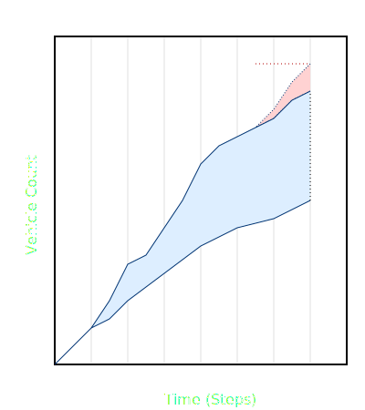
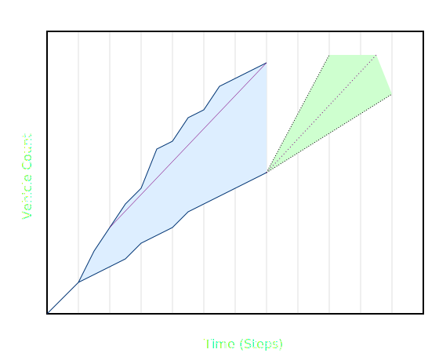
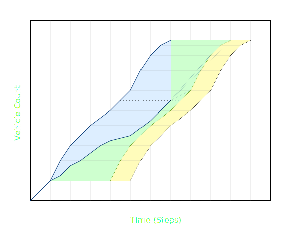
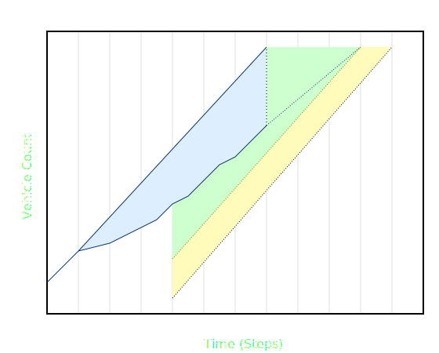
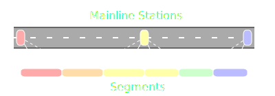
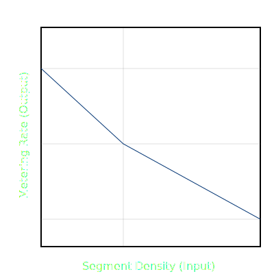
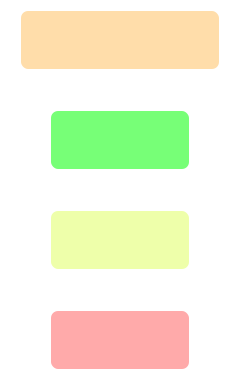

# Density Adaptive Metering

The density adaptive ramp metering algorithm has two main objectives:

1. Delay the onset of freeway mainline congestion for as long as possible.  This
   is achieved by restricting metering rates when density on the mainline
   approaches a critical level
2. Effectively manage the queue at ramp meters:
  - Release rates should be adjusted gradually
  - Wait times should not be longer than a configurable limit — typically 4
    minutes
  - The queue from the ramp meter should not back up onto cross streets

The ramp queue condition and mainline vehicle density are used together to
calculate metering rates.

## Queueing

A queue is formed at a ramp meter when the input (demand) is greater than the
output (passage).  At any point in time, the difference between these counts is
the queue length (in vehicles).  Wait time is estimated by comparing the passage
count with demand counts from previous time intervals.  The vehicle at the head
of the queue started waiting when demand was equal to the current passage count.

### Flow Rate

The slope of accumulated vehicle counts through time is the flow rate.
Typically, it is expressed in vehicles per hour.  For practical metering on
two-lane alternate-release meters, flow can range from 240 to 1800 (about 4 to
30 vehicles per minute).

## Queue Data

Vehicle detection systems on the entrance ramp provide data for monitoring the
queue.  Unfortunately, these systems are not 100% accurate, so special care is
needed when using the data.  From the time when metering begins, total vehicle
counts are recorded for greens, passage and demand.

### Green Count

The green count is the number of green indications which have been displayed on
the ramp meter.  Sometimes called the "release count", it is not a count of
actual vehicles, but it is useful in determining whether or not a queue is
present.

### Passage (Output)

The passage detector is placed just downstream of the ramp meter.  The count
from this detector is used to estimate the output of the queue.  Due to its
placement, it usually records the most accurate counts for an entrance ramp.

### Demand (Input)

A queue detector is placed on the entrance ramp, upstream of the meter.  It
should be located at the tail of the longest acceptable queue.  The count from
this detector is used to estimate the input of the queue.  Note: Some
installations also have "demand" detectors located just upstream of the meter —
these are not usefull for demand counts.

If the queue detector is not counting, demand is set to a fixed target value —
specific to one ramp meter and period (AM or PM).  It is based on historical
demand at the ramp.

### Demand Undercount Correction

If the queue backs up over the detector, the occupancy will jump to greater than
25%.  When this happens, the detector may undercount vehicles.  To correct this,
the estimated queue demand is increased gradually until the queue length is
equal to **maximum storage**.

The _available storage count_ is _maximum storage_ minus current queue length.
_High occupancy duration_ is the number of seconds that occupancy was greater
than 25%.  _Queue overflow ratio_ is 2 times the high occupancy duration divided
by _maximum wait time_, limited to a range between 0 and 1.  The _demand
undercount adjustment_ is equal to the _available storage_ multiplied by _queue
overflow ratio_.

### Empty Queue Correction

When the queue is empty, the demand and green counts are adjusted to match the
passage count.  The following conditions indicate that the queue may be empty:

Queue detector occupancy is below 25%, AND
 * Demand count is below passage count, OR
 * Passage count is below green count

The _empty queue duration_ is the number of seconds that the queue was empty.
The _queue empty ratio_ is 2 times the empty queue duration divided by maximum
wait time, limited to a range between 0 and 1.  The demand overcount adjustment
is the queue length times the queue empty ratio.

## Limits

The metering rate is limited by the **minimum** and **maximum** rates.  These
are determined by the state of the ramp queue.

### Maximum Rate

The maximum rate is normally 125% of the **tracking demand**, but it is
increased to 150% during the **flushing phase**.  This is to prevent the meter
from releasing a queue too quickly.  The maximum rate will not be lower than the
minimum rate.

### Minimum Rate

When the passage detector malfunctions, the minimum rate is equal to the
**tracking demand**.  Otherwise, it is the highest of the following 4 limits:

* Tracking minimum limit (75% of **tracking demand**)
* Queue wait limit
* Queue storage limit
* Backup limit

### Queue Wait Limit

The purpose of the queue wait limit is to keep wait times below a maximum limit.
All past intervals within the target wait time are checked.  Rates are
calculated from the current passage to the accumulated demand at those
intervals, using the remaining target wait time.  The queue wait limit is the
highest of those.

When the queue detector is malfunctioning, the target value for the current
metering period (AM or PM) is used for demand.  This makes the queue wait limit
behave as if the demand is high at all times.  While not optimal, it allows
short queues to be held to break up platoons of vehicles.

### Queue Storage Limit

The queue storage limit prevents the queue from becoming more than 75% full.
The target storage is subtracted from the accumulated demand, then projected to
the target wait time, using the **tracking demand**.  The queue storage limit is
the rate from the current passage to that projected target storage.

When the queue detector is malfunctioning, the target value for the current
metering period (AM or PM) is used for demand.  This makes the queue storage
limit behave as if the demand is high at all times.  While not optimal, it
allows short queues to be held to break up platoons of vehicles.

### Backup Limit

When the queue detector occupancy is greater than 25%, a backup limit is
calculated.  First, the backup factor is "minutes queue detector has been
occupied (greater than 25%) multiplied by the average occupancy over that time."
Then, the backup limit is the **tracking demand** multiplied by 50% plus the
backup factor.

## Mainline Segments

A mainline segment is derived from a contiguous series of mainline stations.
The distance between each pair of stations is divided into 3 links of equal
length.  The first and last links are assigned density from the station adjacent
to them.  The middle link is assigned a density which is an average of the two
stations.  The segment density is an average of all links in the segment,
weighted by length.

### Segment Density

Each meter is associated with a mainline segment at each interval.  This segment
begins at the station just upstream of the meter.  The downstream station must
be within 3 miles of the upstream station.  It is the station which results in
the highest segment density.

## Rate Calculation

Mainline segment density will cause the metering rate to be adjusted within the
rate limits.  The metering rate is calculated iteratively, based on the metering
rate from the previous 30 seconds.  If the **segment density** is below the
**desired density**, the rate will increase.  Likewise, if segment density is
higher than desired, the rate will decrease.  When the meter is first turned on,
the passage rate averaged over the last 90 seconds is used in place of the
previous metering rate.

The previous metering rate is first constrained within the bounds of the new
minimum and maximum rates.  The new rate is calculated using linear
interpolation from the previous rate and density.  With segment density between
zero and desired density, the rate is interpolated between the maximum rate and
the previous rate.  With segment density between desired and **jam density**,
the rate is interpolated between the previous rate and the minimum rate.

## Metering Period

A metering period begins and ends at specific times during the day.  Within the
metering period, a meter can be in one of 4 phases: **not started**,
**metering**, **flushing** or **stopped**.  When transition conditions are met,
the meter moves to the next phase.  If all meters on a corridor are in the
**stopped** phase, the metering period ends.

### Not Started Phase

Ramp meters begin each metering period in this phase.  The meter will not cycle
when in this phase.  There are two conditions which cause the meter to
transition to a different phase.  If **segment density** averaged for 2 minutes
is higher than **desired density**, the phase will change to **metering**.
Otherwise, when only 30 minutes remain in the metering period, the phase will
change to **stopped**.

### Metering Phase

In this phase, a ramp meter will cycle at the selected metering rate.  The
following conditions will cause the meter to transition to the **flushing**
phase:

* **Segment density** averaged for 10 minutes is below **low density**, OR
* Only 2 minutes remain in the metering period

### Flushing Phase

In this phase, a ramp meter will cycle at the **maximum metering rate**.  The
following conditions will cause the meter to transition to the **stopped**
phase:

* The queue is estimated to be empty, OR
* The metering period ends

### Stopped Phase

In this phase, a ramp meter will not cycle.  The following conditions will cause
the meter to transition back to the **metering** phase:

* **Segment density** averaged for 5 minutes is higher than **desired density**,
  AND
* More than 2 minutes remain in the metering period

## Definitions

Term             | Definition
-----------------|-----------
Critical Density | Density threshold for identifying high probability of mainline flow breakdown (37 vehicles per lane-mile)
Density          | Vehicles per lane-mile
Desired Density  | Density threshold for determining whether metering is necessary (90% of critical density, or 33.3 vehicles per lane-mile)
Interval Density | Average of station samples during one 60 second interval
Jam Density      | Density of completely jammed mainline (180 vehicles per lane-mile)
Low Density      | Density threshold for determining whether metering should continue (75% of critical density, or 27.75 vehicles per lane-mile)
Maximum Storage  | Maximum number of vehicles which can be stored in a queue
Station Density  | Average of all valid lanes in a station for one sample period
Tracking Demand  | Average ramp queue flow rate for previous 5 minutes
