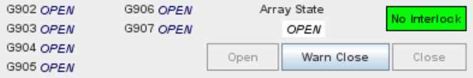

# Gate Arms

Select `View ➔ Gate Arm Arrays` menu item

Gate arms are traffic control devices which restrict access to a section of
roadway.  They are commonly used for on-ramps or reversible lanes.

API Resources 🕵️ 

* `iris/gate_arm_interlock` (lookup table)
* `iris/gate_arm_state` (lookup table)
* `iris/api/gate_arm` (primary)
* `iris/api/gate_arm/{name}`

| Access       | Primary                    | Secondary             |
|--------------|----------------------------|-----------------------|
| 👁️  View      | name, location, arm\_state | ga\_array, idx, fault |
| 💡 Manage    | notes                      |                       |
| 🔧 Configure | controller                 | pin                   |

## Arrays

Gate arms are grouped into **arrays** of 1-8 arms.  _Opening_ or _closing_ an
array controls **all** associated arms.

API Resources 🕵️ 

* `iris/api/gate_arm_array` (primary)
* `iris/api/gate_arm_array/{name}`

| Access       | Primary                   | Secondary                         |
|--------------|---------------------------|-----------------------------------|
| 👁️  View      | name, location, interlock | geo\_loc                          |
| 👉 Operate   | arm\_state                | arm\_state\_next †, owner\_next † |
| 💡 Manage    | notes                     |                                   |
| 🔧 Configure |                           | opposing, prereq, camera, approach, action\_plan |

† _Write only_

## Verification Cameras

One or two [cameras] can be associated with a gate arm array.  This allows
operators to check traffic conditions and verify the status before opening or
closing the gates.  The second camera can be used to monitor approaching
traffic.  The _Swap_ button allows the camera images to be swapped between
larger and smaller views.

## Warning Action Plan

An [action plan] can be associated with a gate arm array.  The plan's [phase]
will be continuously updated according to the array state (see below).

Any number of [device actions] can be assigned to these phases to warn
motorists of the gate arm state.  DMS messages for these are displayed to the
right of the camera view, for up to two signs.

## Operating

Gate arms can be in one of 7 states:

State        | Description             | Plan Phase
-------------|-------------------------|------------
`OPENING`    | opening in progress     | `ga_closed`
`OPEN`       | gate open               | `ga_open`
`WARN_CLOSE` | warn before closing     | `ga_closed`
`CLOSING`    | closing in progress     | `ga_closed`
`CLOSED`     | gate closed             | `ga_closed`
`FAULT`      | fault in gate operation | `ga_closed`
`UNKNOWN`    | no commnuication        | `ga_closed`

Depending on the current array state, one of the buttons will be enabled.  When
an operator presses a button, its corresponding state will be requested:
- `Open` ⇒ `OPENING`
- `Warn Close` ⇒ `WARN_CLOSE` †
- `Close` ⇒ `CLOSING`

None of these three states can be requested automatically by the system -- an
operator must **manually** request them.

† `Warn Close` is only enabled if a [warning action plan] is configured.
Operators should request this state to warn motorists when the gates will soon
be closing.  After checking the verification cameras, the `CLOSING` state can be
requested.

If communication is lost to a gate arm for longer than the value of
`gate_arm_alert_timeout_secs` [system attribute], its state will be set to
`UNKNOWN`.

## Interlocks

Care must be taken to prevent traffic conflicts when operating gate arms.
Two types of constraints are available for this purpose:
- **Open interlock**: prevents opening the gate arm
- **Close interlock**: prevents closing the gate arm

When a gate arm is in any state other than `CLOSED`, it is considered _possibly
open_.

**Opposing Traffic** creates an _open interlock_ constraint -- if _any_ gate is
possibly open in a different direction on the same roadway.

**Prerequisites** prevent a sequence of gates from opening in the wrong order.
If a dependent array's prerequisite is not `OPEN`, it will have an _open
interlock_.  Once they are both open, the prerequisite will have a _close
interlock_ until the dependent is closed.

If a constraint is broken, IRIS will not automatically try to resolve it.
Instead, an _alert_ will logged in the `email_event` table.

## Security

There are a couple of extra security features to restrict access to gate arm
control.

### Allowlist

There is a list of IP addresses from which clients are allowed to control gate
arms.  It is specified as the `gate.arm.allowlist` property in the
`/etc/iris/iris-server.properties` configuration file.  The property contains
a list of addresses in [CIDR] notation (exact IP, or ranges specified such as
`192.168.1.0/24`).

### System Disable

Another security feature causes the entire _gate arm system_ to be disabled
whenever a configuration change is made to any gate arm.  This includes any
changes to a gate arm array, [controller] or associated [comm link].  IRIS will
not send any command to open or close any gate arm while in this state.  The
only way to re-enable gate arm control is to create a file in the server
filesystem at `/var/lib/iris/gate_arm_enable` (using the touch command).

[action plan]: action_plans.html
[cameras]: cameras.html
[CIDR]: https://en.wikipedia.org/wiki/Classless_Inter-Domain_Routing
[comm link]: comm_links.html
[controller]: controllers.html
[device actions]: action_plans.html#device-actions
[phase]: action_plans.html#plan-phases
[system attribute]: system_attributes.html
[warning action plan]: #warning-action-plan
