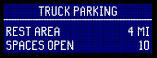

# Message Patterns

Select `View ➔ Message Signs ➔ Message Patterns` or
`View ➔ Message Signs ➔ Message Editor` ([WYSIWYG]) menu items

A _message pattern_ is a partially or fully composed [MULTI] message associated
with a sign config.  They can be:

* Selected by operators [composing messages], for signs matching the _compose_
  [hashtag]
* Scheduled by [device actions] as part of an [action plan]

If **flash beacon** is selected, the sign's _internal_ beacon will also be
activated.

**Pixel service** indicates that the sign should perform scheduled pixel
service while the message is active.  This is useful for messages that are
active for long periods of time.

API Resources 🕵️ 

* `iris/api/msg_pattern` (primary)
* `iris/api/msg_pattern/{name}`

| Access       | Primary                 | Secondary                     |
|--------------|-------------------------|-------------------------------|
| 👁️  View      | name                    |                               |
| 👉 Operate   |                         |                               |
| 💡 Manage    | compose\_hashtag, multi | flash\_beacon, pixel\_service |
| 🔧 Configure |                         |                               |

## Fillable Text Rectangles

Text rectangles within a pattern can be _fillable_ to allow operators to fill
in those areas with [message lines](#message-lines).  A fillable text rectangle
can either be defined by a `[tr…]` tag, or be a full page (`[np]` tag or
beginning of message).

A rectangle is only fillable if it contains no text or `[nl…]` tags.
Additionally, a full page can only be fillable if it contains no `[tr…]` tags.

The text composed by operators will be inserted directly after a fillable text
rectangle.  For example, if the pattern is: `[tr1,1,100,16][g5]`, and the
operator selected the message `CRASH[nl]AHEAD`, the composed message would
be `[tr1,1,100,16]CRASH[nl]AHEAD[g5]`.

## Message Lines

A pattern with fillable text rectangles can have lines of text associated with
it.  Each line is used in a specific fillable rectangle of the pattern.  Lines
can be ordered in the message composer by **rank**, 1-99.  Lines can also be
restricted to specific signs by adding a **restrict** [hashtag].

If a pattern has fillable text rectangles but no lines, a **substitute**
pattern will be chosen to provide them instead.  Both patterns must have the
same number of lines in their text rectangles.

API Resources 🕵️ 

* `iris/api/msg_line` (primary)
* `iris/api/msg_line/{name}`

| Access       | Primary                        | Secondary |
|--------------|--------------------------------|-----------|
| 👁️  View      | name, msg\_pattern             |           |
| 👉 Operate   |                                |           |
| 💡 Manage    | line, multi, restrict\_hashtag | rank      |
| 🔧 Configure |                                |           |

## Message Combining

Scheduled messages can be configured to combine them with the current operator
message (if any).  This can be done in two ways:

- **Sequenced**: 
- **Shared**: 

Properties including foreground color, font, page- and line-justification are
reset to default values by inserting `[cf]`, `[fo]`, `[jp]` and `[jl]` [MULTI]
tags between messages.

### Sequenced

If the scheduled message ends with a default `[cf]` tag, it can be combined
with an operator message to make a repeating _sequence_ of pages.

Example

- Scheduled message:
  `[cr1,1,160,54,0,0,125][cr1,18,160,1,255,255,255][tr1,1,160,17][cf255,255,255][fo5][jp3]TRUCK PARKING[tr4,24,154,30][jl2]REST AREA[jl4]4 MI[nl5][jl2]SPACES OPEN[jl4]10[cf]`
- Operator message:
  `STALLED VEHICLE[nl]IN RIGHT LANE[nl]USE CAUTION`
- Combined message:
  `[cr1,1,160,54,0,0,125][cr1,18,160,1,255,255,255][tr1,1,160,17][cf255,255,255][fo5][jp3]TRUCK PARKING[tr4,24,154,30][jl2]REST AREA[jl4]4 MI[nl5][jl2]SPACES OPEN[jl4]10[cf][np][fo][jp][jl]STALLED VEHICLE[nl]IN RIGHT LANE[nl]USE CAUTION`

### Shared

With this method, the sign is partitioned into two regions, with the operator
message in a _text rectangle_.  The scheduled message is prepended to each page
of the operator message.

- The scheduled message must contain no `[np]` tags.
- The scheduled message must end with a `[tr…]` tag.
- Each page of the operator message must start with that same `[tr…]` tag.
- The operator message must not contain any other `[tr…]` tags.

Example

- Scheduled message:
  `[cr1,1,240,24,1,23,9][cf250,250,250][fo13][tr1,5,240,18][jl3]EXPRESS LANE[tr1,31,240,40]OPEN TO ALL[nl6]TRAFFIC[g7,110,75][cr241,1,2,96,255,255,255][tr243,1,350,96]`
- Operator message:
  `[tr243,1,350,96]STALLED VEHICLE[nl]IN RIGHT LANE[nl]USE CAUTION`
- Combined message:
  `[cr1,1,240,24,1,23,9][cf250,250,250][fo13][tr1,5,240,18][jl3]EXPRESS LANE[tr1,31,240,40]OPEN TO ALL[nl6]TRAFFIC[g7,110,75][cr241,1,2,96,255,255,255][tr243,1,350,96][cf][fo][jp][jl]STALLED VEHICLE[nl]IN RIGHT LANE[nl]USE CAUTION`

[action plan]: action_plans.html
[composing messages]: dms.html#composing-messages
[device actions]: action_plans.html#device-actions
[hashtag]: hashtags.html
[MULTI]: multi.html
[WYSIWYG]: wysiwyg.html
