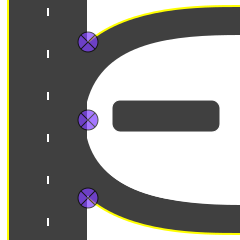

## Road Topology

For many of the features IRIS provides, a model of the road network topology is
needed.  This model consists of a set of _roadway nodes_, or **r_nodes**, which
describe the connection points on the road network.  For instance, each
_entrance_ ramp, _exit_ ramp, _station_ or _intersection_ is represented by an
r_node.

### Corridors

All r_nodes with the same road and direction-of-travel are grouped into
**corridors**.  The r_nodes within a corridor are automatically sorted based on
their coördinates.  Corridors are linked to each other by _exit_ and _entrance_
r_nodes.  For example an _exit_ r_node from Northbound road A to Eastbound road
B would automatically link to an _entrance_ onto Eastbound road B from
Northbound road A.

### Roads

Select `View ➔ System ➔ Roads` menu item

Before creating r_nodes, roads must be created.  With [edit mode] **ON**, enter
the road name into the text box at the bottom of the form and press the
**Create** button.

Field      | Description
-----------|---------------------------------------------------------
name       | Unique road name, including affixes such as "St" or "Rd"
abbrev     | Abbreviation (up to 6 characters), used for labeling [detectors]
road class | _Freeway_, _arterial_ etc.  Affects style of map segments
direction  | Primary direction

### R_Nodes

Select the **R_Nodes** tab on the client interface to create or edit r_nodes.

In the **Selected Roadway Corridor** frame, there is a **Corridor** widget
containing a list of all corridors which contain at least one r_node.  When a
corridor is selected, the r_node list will be populated with all r_nodes on the
corridor.  Also, any new r_nodes created will be on the selected corridor.

Press the **Add** button in the **Selected Roadway Corridor** frame to start
creating a new r_node.  The mouse cursor will change to a crosshair while over
the map.  Select a point and the new r_node will appear there, as well as in the
selected corridor list.

Once an r_node is selected, any fields can be edited.  Changing the _roadway_ or
_direction_ will move the r_node to another corridor.  Other attributes are
nearest _cross-street_, _cross-street direction_, and _notes_.

#### R_Node Types

Node Type    | Description
-------------|---------------------------------
station      | Detector station or shape node
entrance     | Entrance ramp onto corridor
exit         | Exit ramp off corridor
intersection | At-grade intersection with another corridor
access       | Network access (for traveler information)
interchange  | Freeway interchange (for traveler information)

#### R_Node Transitions

An r_node transition describes how _entrance_ or _exit_ nodes connect with
linked nodes.

Transition | Description
-----------|------------------
none       | No transition — non-entrance or -exit r_nodes
loop       | Interchange _loop_ ramp
leg        | _Leg_ ramp
slipramp   | Transition ramp between parallel road corridors
CD         | Transition to or from a _collector/distributor_ road
HOV        | Bypass ramp for _high occupancy vehicles_
common     | Common section joining two corridors
flyover    | Flyover ramp (bridge over mainline)

#### Lanes

The meaning of lanes depends on the r_node type.  For an _entrance_ or _exit_
ramp, this is the number of lanes entering or exiting the corridor.  For other
types, it is the number of lanes on the corridor.

#### Shift

Lane shift is the difference (number of lanes) between the corridor reference
lane and the _attach side_ of the r_node.  This value is used for lane
continuity analysis within a corridor.  Each corridor has a reference lane,
which corresponds to the leftmost lane along the entire corridor.

#### Station ID

A unique identifier for the [detectors] associated with a _station_ r_node.
It is displayed on the [traffic layer].

#### Speed Limit

This is the posted speed limit at the r_node.  The units are miles per hour.
For ramp r_nodes, it may be used to indicate the advisory speed limit on the
ramp.  The limit is used in [travel time] estimation.

#### Pickable

A _pickable_ r_node can be used for [incident locator]s when deploying [DMS]
from an incident.

#### Above

When rendering the [traffic layer], r_nodes are rendered in two passes.  The
second pass consists of r_nodes which have been marked **above**.  This prevents
overpasses from being drawn incorrectly.

#### Attach Side

This flag indicates whether the r_node is attached to the left side of the road.
This can be used to create left entrance or exit ramps.

#### Active

This flag allows an r_node to be deactivated.  An inactive r_node will not be
included in any corridor or drawn on the [traffic layer].

#### Detectors

The r_node **Detectors** tab allows vehicle [detectors] to be created and
associated with an r_node.

[detectors]: vehicle_detection.html
[DMS]: dms.html
[edit mode]: user_interface.html#edit-mode
[incident locator]: incident_dms.html#locator
[traffic layer]: vehicle_detection.html#traffic-layer
[travel time]: travel_time.html
