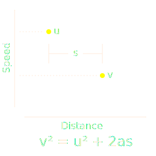

# Variable Speed Advisory

The `[vsa]` [action tag] is used to display speed advisory warnings on signs.
It will cause a message to be displayed only when approaching congestion —
otherwise the message will be blank.  The tag itself will be replaced with an
_advisory speed_, but the rest of the message can be any valid MULTI string.

The goal is to promote a safe, **uniform deceleration** for vehicles approaching
congestion.  Speed advisory signs are activated to warn motorists of slow
traffic ahead.

A _bottleneck_ is activated when the uniform rate of deceleration is found to be
unsafe.  The standard equation for uniform acceleration is used to determine
when variable speed advisories must be deployed.

## Policy Parameters

Each mainline station has an associated [speed limit] **L** (mph), as well as
the distance from the upstream end of [corridor] to station.  These are used to
calculate advisories.  There are also system attributes to control system-wide
parameters.

System Attribute        | Default | Description
------------------------|---------|-----------------
`vsa_bottleneck_id_mph` | 55 mph  | Maximum speed at a station to be identified as a bottleneck
`vsa_control_threshold` | -1000   | Threshold for control distance (mi/hr²)
`vsa_downstream_miles`  | 0.2 mi  | Largest distance downstream of a bottleneck to activate signs
`vsa_max_display_mph`   | 55 mph  | Maximum advisory speed to display
`vsa_min_display_mph`   | 30 mph  | Minimum advisory speed to display
`vsa_min_station_miles` | 0.1 mi  | Minimum distance between stations
`vsa_start_intervals`   | 3       | Intervals to activate a bottleneck
`vsa_start_threshold`   | -1500   | Threshold to activate a bottleneck (mi/hr²)
`vsa_stop_threshold`    | -750    | Threshold to deactivate a bottleneck (mi/hr²)

## Station Sample Speeds

Speed in miles per hour, average of lanes in station.  A rolling average is
used, with the number of sample intervals depending on the current average
station density.  Samples older than the oldest sample used in the previous time
step are not used.  Also, the sample count is reduced to 2 whenever there is a
clear upward or downward trend in the last 3 speed samples.

Current Density | Sample Count | Sample period
----------------|--------------|------------------------
below 10 vpm    | N/A          | N/A (Speed Limit **L**)
10-15 vpm       | 6 samples    | 3 minutes
15-25 vpm       | 4 samples    | 2 minutes
25-40 vpm       | 3 samples    | 1.5 minutes
40-55 vpm       | 4 samples    | 2 minutes
above 55 vpm    | 6 samples    | 3 minutes

## Deceleration Thresholds

NOTE: using precipitation rates to control thresholds is not yet implemented.

There are three thresholds for determining a bottleneck: _start_, _control_, and
_stop_.  The thresholds are based on the pavement conditions, measured using
a precipitation sensor.  There are seperate thresholds for _dry_, _light rain_,
_moderate rain_, _heavy rain_, and _ice_.  The units are in mi/hr², and negative
values indicate deceleration instead of acceleration.

Precipitation | Start | Control | Stop
--------------|-------|---------|-----
Dry           | -1500 | -1000   | -750
Light rain    | -1200 | -800    | -600
Moderate rain | -1050 | -700    | -525
Heavy rain    | -900  | -600    | -450
Ice           | -750  | -500    | -375

[action tag]: action_plans.html#dms-action-tags
[corridor]: road_topology.html#corridors
[speed limit]: road_topology.html#speed-limit
