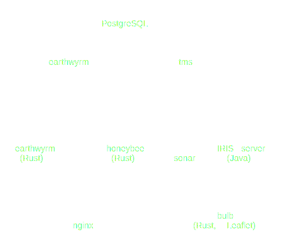

# Web User Interface

This document tracks progress on the web-based user interface for IRIS.

## Major Systems

- **earthwyrm** — [Earthwyrm] is a web mapping service for [MVT], or Mapbox
  Vector Tiles.  Layers can be made from [OpenStreetMap] data in addition to
  IRIS devices, such as DMS.
- **honeybee** — Honeybee is a web service for JSON data in addition to rendered
  GIF images of DMS.  It is included in the IRIS repository.
- **bulb** — Bulb is the web front-end for IRIS.  The mapping portion uses the
  [Leaflet] JavaScript library.  The rest of the code is written in Rust,
  compiled as WebAssembly.

## Phase 1 — Segment Map

* Earthwyrm
  - [X] Serve MVT for OpenStreetMap layers
  - [X] Update to use [MuON] for configuration
* Honeybee
  - [X] Generate JSON for cameras, DMS, etc.
  - [ ] Generate segment map layer in earthwyrm DB
* Bulb
  - [X] Set up build using wasm-pack
  - [X] Integrate leaflet map
  - [ ] Style segment layer with detector data

## Phase 2 — Authentication

* honeybee
  - [ ] Turn into web service (actix-web)
  - [ ] Connect to IRIS server with sonar
  - [ ] Authentication endpoint using tokens
* bulb
  - [ ] Handle authentication page

## Phase 3 — Comm Link Administation

* honeybee
  - [ ] Add comm config pages
  - [ ] Add comm link pages
  - [ ] Add controller pages
  - [ ] Send SSE for update notifications
* bulb
  - [ ] Connect to honeybee for SSE

## Phase 4 — DMS control

* honeybee
  - [X] Generate GIF images for DMS
  - [ ] Generate DMS map layer in earthwyrm DB
  - [ ] Add endpoints for controlling DMS
* bulb
  - [ ] UI for DMS viewing / control
  - [ ] Generate DMS previews and insert into img element using data URI

[earthwyrm]: https://github.com/DougLau/earthwyrm
[Leaflet]: https://github.com/Leaflet/Leaflet
[MuON]: https://github.com/muon-data/muon
[MVT]: https://docs.mapbox.com/vector-tiles/reference/
[OpenStreetMap]: https://www.openstreetmap.org
